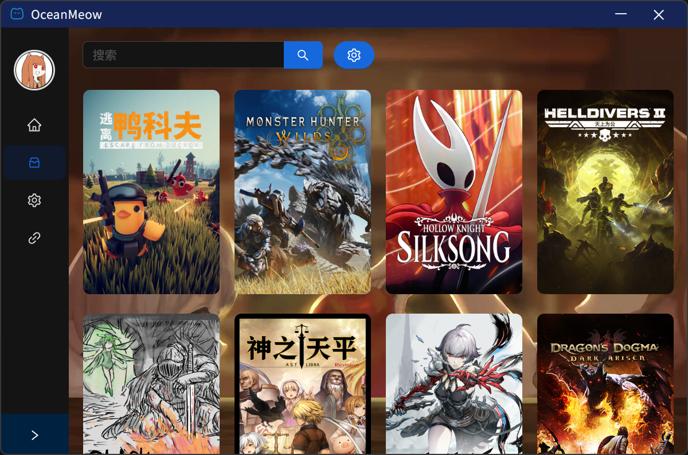
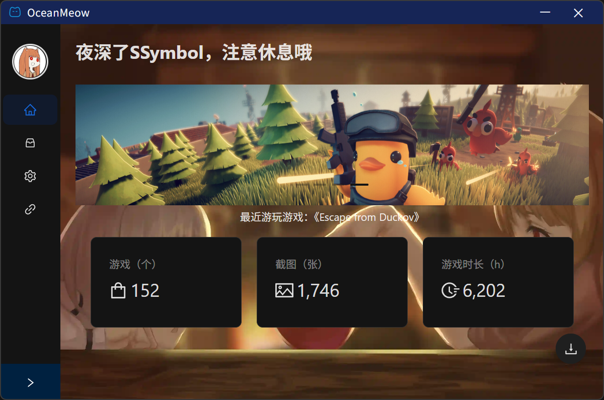
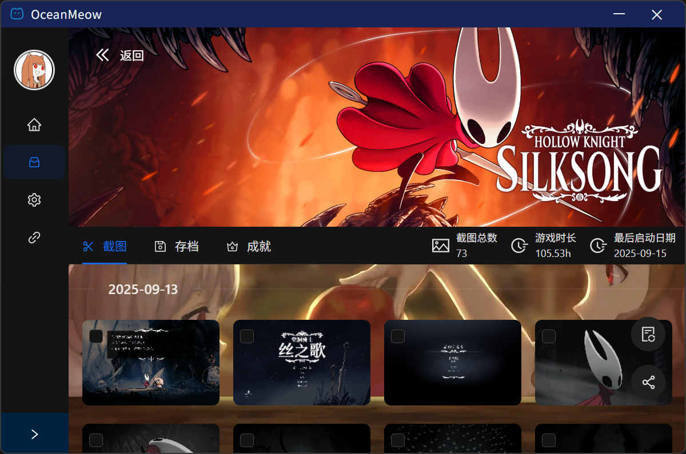
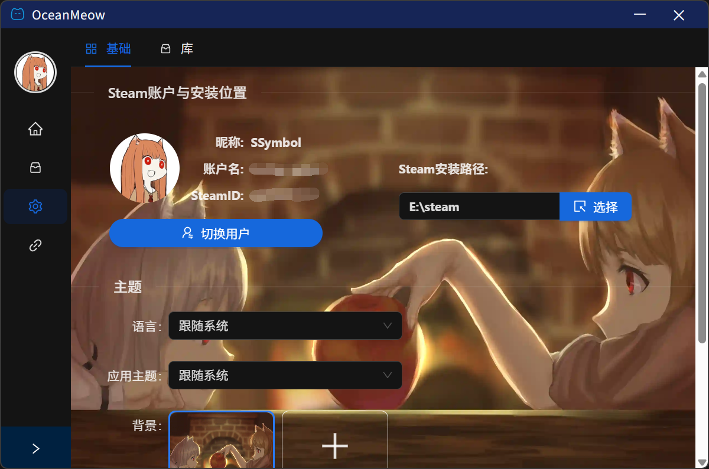
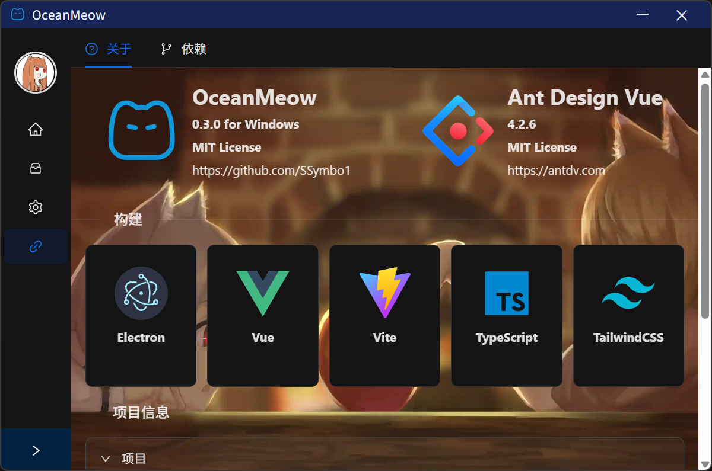

<div align="center">
    <h1>OceanMeow</h1>
    
    <div align="center">

**English** | [**中文**](../README.md)

</div>
    <strong>Application of centralized management for screenshots and archives of Steam games</strong>
    <br/><br/>
    
</div>

## 📖 Introduce

OceanMeow is a desktop application based on Electron+Vue3, which is used to centrally manage the screenshots and archives of Steam games. It can help users better manage and share the screenshots of Steam game, and provide functions such as account data statistics.

## 🔨 Local Build

### Install Dependencies

```bash
pnpm install
```

### Project Initialization

```bash
pnpm run project:init
```

### Run

```bash
pnpm run dev:eletron
```

### Build

```bash
pnpm run build:eletron
```

For problems related to local construction, please refer to [Construction Related Problems](./docs/dependency_install.md). If you use VS Code for development and encounter problems related to the workspace, please refer to [VS Code Workspace Configuration](./docs/vscode_workspace.md) to set the workspace of the project.

## 💡 Features

- [x] Export screenshots of local Steam game
- [x] Local Steam game screenshot shared across devices in LAN
- [x] Statistics of local Steam game data
- [x] Multi Steam Account Switching
- [x] Automatically retrieve Steam installation path
- [x] Personalization
- [x] Tray application
- [ ] Statistics of local Steam game achievements
- [ ] Local Steam game archive management
- [ ] Multi language support

## 🎨 Preview









## 🚫 Disclaimer

[DISCLAIMER](./DISCLAIMER_en.txt)
